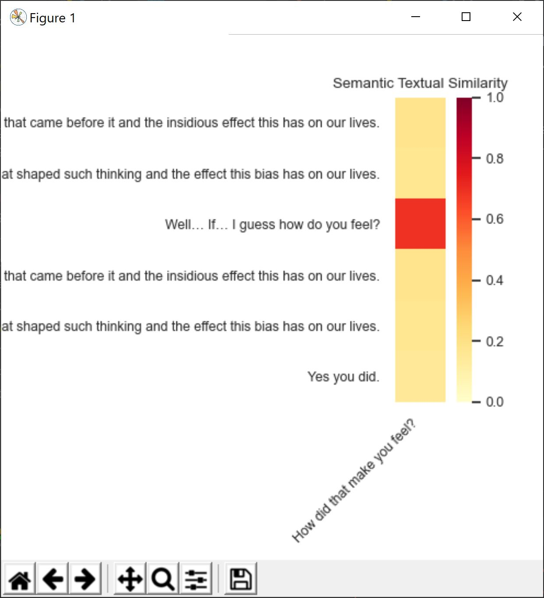

# Meaningly

A NLP search tool for querying coded research study transcripts and finding similar sentences. 
API + GUI built on top of the Universal Sentence Encoder that lets the user enter sentences
and find similar ones in a transcript. The user can add a custom threshold (between 0 and 1)
which represents the percentage above which the text sentences must be correlated to the input.

  

## Inputs

### File
The path to the document with the transcript. _Must be a word doc_  
 
### List of phrases
List of sentences to search the text for. Include all punctuation
and start each new sentence one a new line.

### Threshold
When given a threshold, the program will only display sentences that
are correlated to the input phrases above the given value.
_Default is 0. Must be a decimal value between 0 and 1._

### Symbol
**Not Implemented yet.** ~~Symbol after which the actual text/dialogue starts. 
Useful for parsing out names of speakers, etc.~~ Currently the program begins reading
the sentence after a ":" (colon).

 ## Example:  
 
 
 
 
 
 
